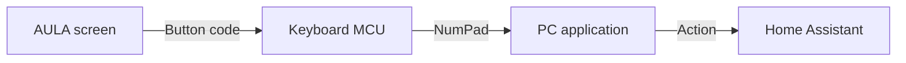
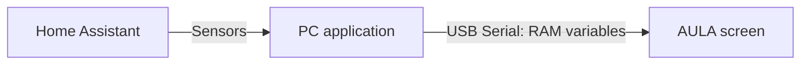

# AULA L99: a custom screen and Home Assistant

[Русская версия](README.ru.md) · [Architecture](docs/architecture.md) · [Image format](docs/image-format.md) · [Protocols and addresses](docs/protocol.md) · [Recovery](docs/recovery.md)

How we turned the AULA L99 keyboard's touchscreen into a home-control panel and a live energy display: the architecture, exact addresses, working results, and limits of what we verified.

This project grew from experiments on one L99: first a new icon, then a redesigned numpad, a 12-button HOME panel, Russian labels, and a clock displaying Home Assistant readings. Hardware checks took place in September 2026. This write-up was prepared on October 1, 2026.

**The main result is a customizable interface running on the stock MCU logic.** We changed resources, page descriptions, and touch records in `UartTFT-II_Flash.bin`. We did not flash our own replacement executable firmware onto either MCU. A Windows application handles home control; the keyboard does not connect to Home Assistant by itself.

## How it works

**Control: a touch becomes an action.**

**Sensors: readings travel back to the screen.**

These are two different paths. Button events reach the PC **through the keyboard**; sensor updates go **directly from the PC to the screen**. Ordinary keyboard input continues to work. Home control requires a running PC and background application.

### Why use numpad events?

The screen already sends numeric-keypad commands. We kept those known commands and replaced the number graphics with home-control buttons. On the PC, a handler suppresses those key events and invokes the configured HA action. The top number row is unaffected. Num Lock is not required: the handler recognizes the scan code and both virtual-key variants.

**Limitation:** the Windows hook used here cannot distinguish the AULA touchscreen from another keyboard's physical numpad. While control is enabled, the corresponding keys on any numpad are reserved for the panel. Without the application, they type numbers or perform navigation again. Changing a button's artwork alone does not change its command.

### Where the energy readings come from

The application reads HA, formats the values as short ASCII strings, and writes them to allocated screen variables. The modified pages already contain widgets that know where to display those strings. Static Russian labels are bitmaps; we did not add arbitrary Unicode support to the stock font engine.

A dedicated page shows PV power, grid power, battery charge, floor temperature, and two daily energy totals. The analog clock uses the first four values from the same block. Unknown readings display as `--`, not zero. The UI image and sender must agree on the layout: writing arbitrary variables in the factory UI will not create a new page.

## What worked, and what remains unverified

| Capability | Status |
|---|---|
| Redesigned numpad and 12-button HOME panel | User-confirmed on hardware |
| HA control from the touchscreen, including on/off | Confirmed on hardware |
| Background interception without typing digits into the active window | Confirmed in the Windows application used for the experiment |
| Static Russian labels, Home menu entry, revised background resources | Positive user check; not an exhaustive test of every page |
| Clock readings update without reopening the page | Confirmed; the cause of initially blank fields remains unknown |
| F13/F14 instead of numpad keys | Candidate tested only in limited emulation; never flashed |
| Complete replacement MCU firmware or a ready L99 QMK port | Not implemented |
| Recovery from any bootloader corruption | Not established |

## What is published

The main contribution is the explanation and reproducible technical evidence:

1. [Architecture and the button-event path](docs/architecture.md): two USB devices, the PC's role, 12 buttons, and limitations.
2. [Screen image format](docs/image-format.md): tables, bitmaps, languages, offsets, and patch verification.
3. [Protocols and MCU analysis](docs/protocol.md): runtime RAM, ISP, M*Core, keyboard resource 4000, and F13/F14.
4. [Recovery and failed experiments](docs/recovery.md): what worked on our specimen and what it does not guarantee.
5. [Reproduce the research without a device](docs/reproduce.md): extract official files, inspect the UI, and test packet formats offline.
6. [Primary sources and acknowledgements](docs/sources.md).
7. [Validation of the published tools](docs/validation.md).

`tools/` contains source for offline extraction, UI inspection, and packet codecs. These tools do not open USB/COM or launch an updater. **This is a research publication, not a ready-to-install HOME application or flashing kit.** The working Windows application and our UI build chain are described here but have not yet been packaged as a general-purpose public product. Complete factory or modified BIN files, updater EXEs, SDKs, home-configuration snapshots, and tokens are not distributed.

## Where to start

Read the architecture first. For custom artwork, continue with the image format and offline inspector. For HA integration, start by recognizing touchscreen numpad events in a local demo with no real device actions, then connect one explicitly selected HA action.

For a complete firmware replacement, read the MCU section carefully: `EEEF:268A` does not prove LT7689. Our HFD images contain M*Core code consistent with LT168. UI-file offsets, runtime variables, CPU addresses, and physical flash addresses are different address spaces.

This is independent research, not an official AULA project. Identify a verified file by SHA-256, not just its name or version number. Success on one board does not establish compatibility with every revision.

## Contributing

The most useful contributions are PCB-revision identification, clear chip-marking and service-pad photographs, a verified hardware-recovery path, protocol observations, and minimal reproducible examples. In an issue, include the version, file SHA-256, and steps; distinguish observation from hypothesis. Do not attach tokens, SSH keys, home configurations, traffic captures containing authorization, or complete vendor images.

The write-up and our tools are licensed under GPL-2.0-only; see [LICENSE](LICENSE). This does not license third-party firmware, SDKs, or artwork extracted separately by a user. Sources and attribution are listed in [sources.md](docs/sources.md).

---

Even under bombardment, we keep working and sharing knowledge. Slava Ukraini! 🇺🇦
