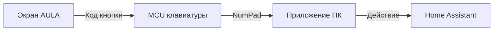
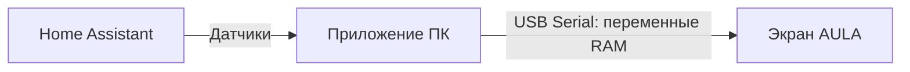

# AULA L99: свой экран и Home Assistant

[English overview](README.en.md) · [Архитектура](docs/architecture.md) · [Формат образа](docs/image-format.md) · [Протокол и адреса](docs/protocol.md) · [Восстановление](docs/recovery.md)

Как превратить сенсорный экран клавиатуры AULA L99 в панель управления домом и показывать на нём данные энергии — с объяснением устройства, конкретными адресами и границами проверенного.

Этот проект вырос из работающего эксперимента на одном экземпляре L99: сначала новая иконка, затем нампад, панель из 12 кнопок, русские надписи и часы с показаниями Home Assistant. Проверки на устройстве проводились в сентябре 2026 года. Публикация подготовлена 1 октября 2026 года.

**Главный результат — изменяемый интерфейс поверх штатной логики.** Мы меняли ресурсы, описания страниц и сенсорных зон в `UartTFT-II_Flash.bin`. Собственную замену исполняемой прошивки двух MCU на устройство не загружали. Управление домом выполняет Windows-приложение; клавиатура сама не подключается к Home Assistant.

## Как это работает

**Управление: касание превращается в действие.**

**Датчики: показания возвращаются на экран.**

Это два разных пути. Нажатие идёт **через клавиатуру в ПК**, а новые значения датчиков — **из ПК прямо в экран**. Обычные клавиши продолжают работать. Для управления нужен работающий ПК и фоновое приложение.

### Почему используем нампад

Экран уже умеет отправлять команды цифрового блока. Мы сохранили известные команды и нарисовали вместо цифр кнопки дома. На ПК обработчик подавляет ввод этих клавиш и вызывает нужное действие HA. Верхний ряд цифр не перехватывается; Num Lock не требуется, поскольку учитываются scan code и оба варианта virtual key.

**Ограничение:** использованный Windows hook не различает экран AULA и физический нампад другой клавиатуры. При включённом управлении соответствующие клавиши любого нампада заняты панелью. Без приложения они снова печатают цифры или выполняют навигацию. Простая смена подписи в картинке не меняет отправляемую команду.

### Откуда берётся энергия

Приложение читает HA, форматирует значения в короткие ASCII-строки и записывает их в выделенные переменные экрана. Изменённые страницы уже знают, где эти строки отображать. Постоянные русские подписи — картинки; мы не добавляли произвольный Unicode в штатный шрифтовый движок.

На отдельной странице отображаются PV, мощность сети, заряд, температура пола и две суточные энергии. В аналоговых часах используются первые четыре значения из того же блока. Неизвестные данные показываются как `--`, а не как ноль. Нужны согласованные версия UI и передатчик — случайная запись в переменные заводского интерфейса не создаст новую страницу.

## Что получилось и что не доказано

| Возможность | Статус |
|---|---|
| Новый дизайн нампада и панель HOME из 12 кнопок | Подтверждено пользователем на устройстве |
| Управление HA из сенсорной панели, включая включение/выключение | Подтверждено на устройстве |
| Работа перехвата в фоне, без печати цифр в активное окно | Подтверждено в используемом Windows-приложении |
| Русские статические надписи, Home в меню, изменённые фоновые ресурсы | Положительная пользовательская проверка; не исчерпывающий тест всех страниц |
| Показания в часах обновляются без повторного открытия страницы | Подтверждено; причину первоначально пустых полей не установили |
| F13/F14 вместо нампада | Кандидат проверен только частичной эмуляцией; на устройство не загружался |
| Полная новая firmware MCU / готовый QMK-порт L99 | Не реализовано |
| Восстановление после любого повреждения загрузчика | Не доказано |

## Что опубликовано

Основная ценность здесь — объяснение и воспроизводимые технические сведения:

1. [Архитектура и путь кнопки](docs/architecture.md): два USB-устройства, роль ПК, почему 12 кнопок, ограничения.
2. [Формат экранного образа](docs/image-format.md): таблицы, bitmap, языки, адреса, метод проверки правок.
3. [Протокол и исследование MCU](docs/protocol.md): runtime RAM, ISP, M*Core, keyboard resource 4000 и F13/F14.
4. [Восстановление и неудачные опыты](docs/recovery.md): что помогло на нашем экземпляре и чего это не гарантирует.
5. [Повторить исследование без устройства](docs/reproduce.md): извлечь официальные файлы, разобрать UI, проверить пакеты офлайн.
6. [Первичные источники и благодарности](docs/sources.md).
7. [Проверка опубликованных инструментов](docs/validation.md).

В `tools/` — исходники офлайн-извлечения, инспектора UI и кодеков пакетов. Они не открывают USB/COM и не запускают загрузчик. **Это публикация исследования, не готовый установщик HOME и не комплект для прошивки.** Рабочее Windows-приложение и цепочка сборки нашего UI здесь описаны, но ещё не упакованы в универсальный публичный продукт. Полные заводские/изменённые BIN, updater EXE, SDK, снимки домашней конфигурации и токены не распространяются.

## С чего начать

Сначала прочитайте архитектуру. Если интересен свой дизайн — затем формат образа и офлайн-инспектор. Если нужен HA — начните с распознавания экранного нампада в локальном демо без реальных устройств, затем подключайте явно выбранное действие.

Если интересна полная новая firmware, особенно важно прочитать раздел MCU: `EEEF:268A` не доказывает LT7689. Наши HFD-образы содержат M*Core-код, согласующийся с LT168. Таблицы UI, RAM-переменные, CPU-адреса и физические адреса flash — разные пространства.

Это независимое исследование, не официальный проект AULA. Проверенный файл определяется SHA-256, а не одним названием или номером версии. Эксперимент на одной плате не доказывает совместимость со всеми ревизиями.

## Вклад сообщества

Полезнее всего подтверждения ревизий PCB, качественные фото маркировок и сервисных площадок, проверенный путь аппаратного восстановления, наблюдения протокола и минимальные воспроизводимые примеры. В issue указывайте версию, SHA-256 файла, шаги и отдельно наблюдение/предположение. Не прикладывайте токены, SSH-ключи, домашние конфигурации, дампы трафика с авторизацией или полные заводские образы.

Текст и собственные инструменты этого репозитория: GPL-2.0-only, см. [LICENSE](LICENSE). Лицензия не распространяется на сторонние firmware, SDK и графику, которые пользователь извлекает отдельно. Источники и авторство перечислены в [sources.md](docs/sources.md).
